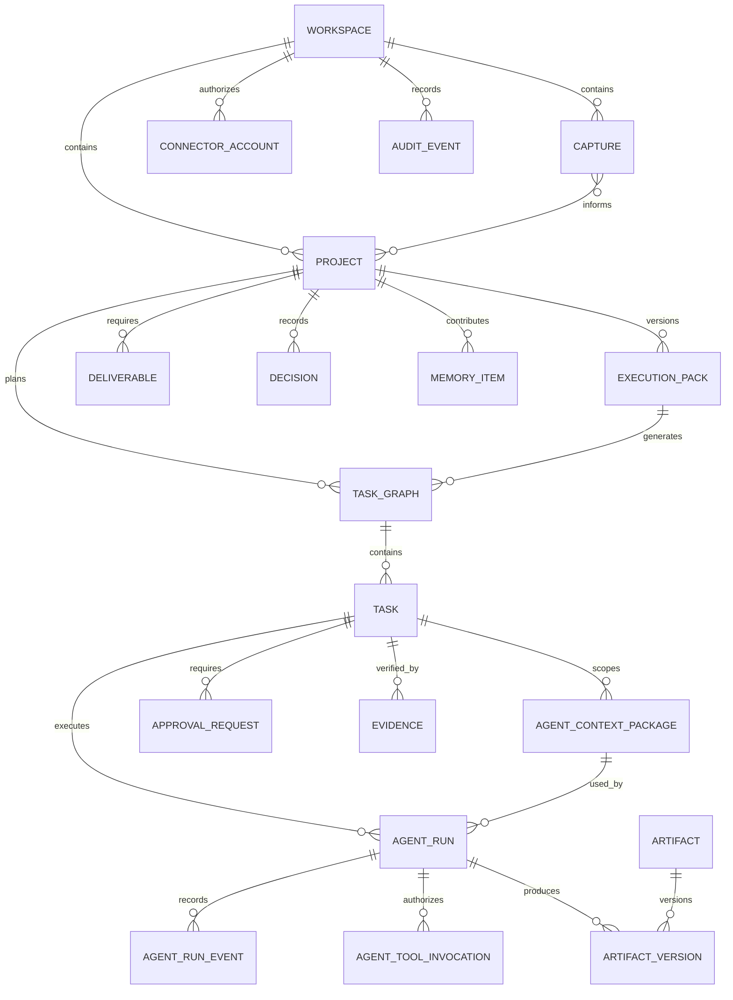

# Domain and Data Model

## Core entities

### User
Represents a human account. The MVP has one owner user but retains role and organization fields for future expansion.

### Workspace
Logical security and data boundary. Ryan's personal workspace is the first workspace.

### Capture
An immutable record of incoming context such as a conversation, file, note, URL, or repository reference.

### SourceObject
The original binary or remote reference associated with a capture.

### Project
The durable unit of intended outcome and coordinated execution.

### ProjectRelation
Connects related projects using relation types such as duplicate, parent, child, replaces, depends_on, and inspired_by.

### ExecutionPack
A versioned plan for a project.

### Deliverable
A defined output with acceptance criteria and destination.

### TaskGraph
A dependency-validated task set generated from one approved execution-pack version.

### Task
An executable unit of work.

### TaskDependency
A directed dependency between tasks.

### AgentDefinition
A versioned specialist role with policies, tools, instructions, and output schemas.

### AgentContextPackage
An immutable, checksum-addressed task context tied to an exact project, task graph, approved execution-pack version, agent definition, source selection, constraints, tool policy, and execution ceilings.

### AgentRun
One execution attempt by an exact agent-definition version using one exact context package. It retains model route, state, usage, cost, retry lineage, verification lineage, timestamps, output, and error data.

### AgentRunEvent
An append-only, monotonically sequenced state or activity record for one run.

### AgentToolInvocation
An immutable tool authorization receipt containing the tool name, argument hash, allow or deny decision, result, and error.

### ApprovalRequest
A request for human authorization before a protected action.

### Artifact
A generated or imported output.

### ArtifactVersion
An immutable version of an artifact.

### Decision
A durable record of a choice and its rationale.

### Evidence
Proof used to verify a task, deliverable, or project.

### MemoryItem
A curated, reversible fact, preference, decision, or reusable context item.

### ConnectorAccount
An authorized external-system account.

### AuditEvent
An immutable record of a meaningful security, data, agent, or external action.

## Key relationships

## Data integrity rules

1. Captures and source objects are immutable after ingestion except for redaction metadata.
2. Execution packs are versioned; approval refers to a specific version.
3. Task readiness is derived; a task cannot start or complete while a blocking dependency is unresolved.
4. A protected action cannot execute without a valid, unexpired approval.
5. Artifact versions are immutable and checksum-addressed.
6. Deleting a project uses soft deletion and does not delete audit events.
7. Memory items must identify their source and confidence.
8. Agent definitions and context packages are immutable.
9. Agent runs cannot modify or delete historical events and tool receipts.
10. A retry creates a new run and preserves parent and context lineage.
11. A source run can reach success only through a QA verification run.
12. Event sequence numbers are unique within a run.

## Suggested PostgreSQL schemas

- `identity`
- `core`
- `planning`
- `execution`
- `content`
- `integration`
- `audit`

## Identifier strategy

Use UUIDv7 for sortable, globally unique IDs.

## Timestamps

Store all timestamps in UTC. Present them using the workspace timezone, initially `Asia/Manila`.

## Sensitive data classification

- Public
- Internal
- Confidential
- Restricted

Restricted records require stricter connector and model-routing policies.

## Retention

- Audit events: indefinite by default
- Agent run traces: 365 days, configurable
- Original captures: indefinite until archived or explicitly deleted
- Temporary extraction files: 24 hours
- Deleted object binaries: 30-day recovery window before purge
