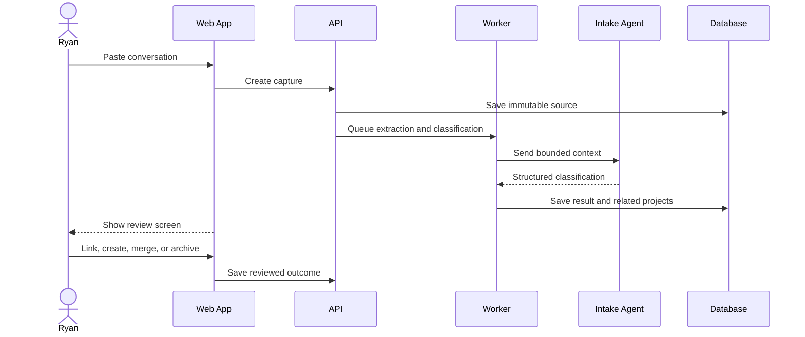
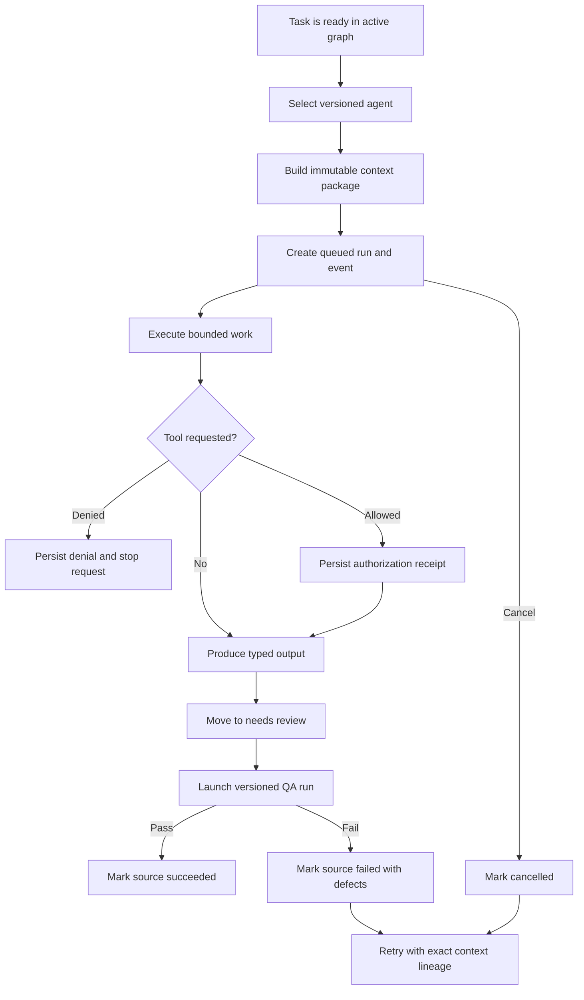

# Core Workflows

## Workflow 1: Conversation to project

### Review options

- Create new project
- Add to an existing project
- Merge with a related project
- Mark as reference only
- Archive

## Workflow 2: Execution pack approval

1. Planner creates a versioned execution pack.
2. System validates required sections.
3. Ryan reviews assumptions, deliverables, tasks, and approvals.
4. Ryan edits or approves the exact version.
5. Approval unlocks task-graph generation for that exact version.
6. Ryan explicitly creates the graph; repeated creation is idempotent.
7. The system rejects dependency cycles and derives readiness from live dependency state.
8. Only tasks from active graphs enter the implementation queue.

Changes after approval create a new execution-pack version. Generating its graph supersedes the prior active graph without deleting historical traceability.

## Workflow 3: Agent task execution

### Current execution rules

1. Only a ready task in the active task graph can launch a run.
2. The selected agent definition and context package are immutable.
3. Every state transition creates a sequenced event.
4. Tool allow and deny decisions are retained as receipts.
5. Execution ends in `needs_review`, not success.
6. A QA child run is the only path to `succeeded`.
7. Retrying creates a new run and retains the original context ID and parent run ID.
8. The run console exposes actions, usage, cost, output, errors, and a resumable live trace.

The current executor and QA evaluator are deterministic baselines. Provider-routed general execution and real connector calls remain deferred.

## Workflow 4: Protected external action

Example: create a GitHub pull request.

1. Agent prepares the proposed action and preview.
2. Policy engine identifies the action as protected.
3. Approval request records scope, destination, changes, and expiry.
4. Ryan approves, rejects, or edits.
5. Connector executes using an idempotency key.
6. External response is stored.
7. Evidence links the response to the task.

## Workflow 5: Artifact generation

1. Task declares required artifact type and acceptance criteria.
2. Artifact specialist selects the proper renderer and template.
3. Source context and style rules are assembled.
4. Draft artifact is generated.
5. Automated checks validate file integrity and required content.
6. Visual inspection runs where relevant.
7. Ryan reviews when required.
8. Approved version is delivered to the configured destination.

## Workflow 6: Project completion

A project can enter `completed` only when:

- Required deliverables are verified
- Blocking tasks are verified or formally waived
- Required approvals are recorded
- Final artifact destinations are known
- Open risks are accepted or closed
- A completion summary is generated

## Workflow 7: Resuming stale work

When a project has no meaningful update for seven days:

1. System creates a stale-project review.
2. It summarizes current state, blockers, and last decisions.
3. It proposes continue, pause, merge, or archive.
4. It identifies the smallest useful next action.
5. Ryan's choice updates the implementation queue.

## Workflow 8: Daily operating brief

The optional daily brief contains:

- Top three recommended actions
- Items awaiting approval
- Newly blocked work
- Agent failures requiring attention
- Projects nearing completion
- Recently delivered artifacts

The brief must prioritize decisions and actions, not generate a wall of status confetti.
