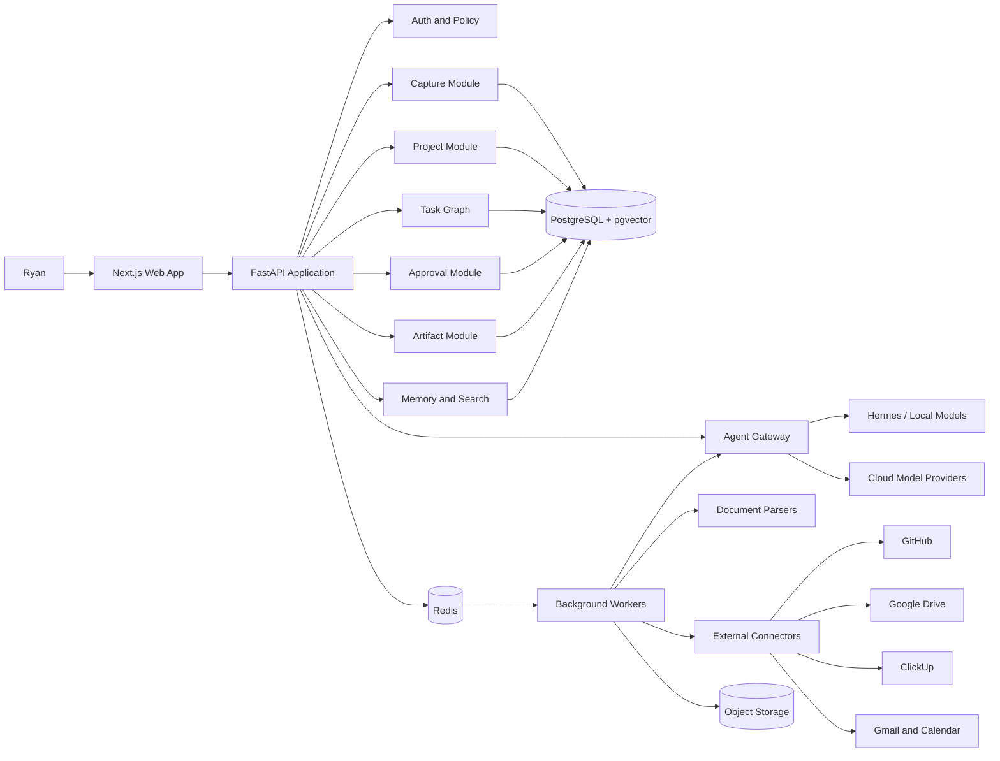

# System Architecture

## Architecture choice

Ryan Agent OS starts as a modular monolith with background workers and clearly separated domain modules. This provides faster development and simpler operations than premature microservices while preserving future extraction boundaries.

## High-level architecture



## Major components

### Web application

Responsibilities:

- Capture interface
- Implementation queue
- Project workspace
- Execution pack editor
- Agent run console
- Approval center
- Artifact viewer
- Search
- Settings and connector management

The web app contains presentation logic only. Domain decisions remain in the API.

### API application

Responsibilities:

- Authentication and authorization
- Domain validation
- Transactional writes
- Query APIs
- Policy evaluation
- Job submission
- Webhook handling
- Audit logging

### Background workers

Responsibilities:

- File extraction
- Embedding generation
- Classification
- Duplicate detection
- Execution pack generation
- Agent runs
- External connector operations
- Artifact conversion
- Verification jobs

### PostgreSQL

PostgreSQL is the system of record for structured records. pgvector stores embeddings for semantic retrieval. Object binaries remain in object storage.

### Redis

Redis provides:

- Job queue backing
- Short-lived locks
- Idempotency keys
- Rate limiting
- Cache
- Live agent run events

Redis is not a source of truth.

### Object storage

Stores original inputs, generated artifacts, exports, screenshots, and evidence files. Each object is addressed through a database record containing checksum, content type, sensitivity, and provenance.

### Agent gateway

The gateway exposes one internal interface for model providers and agent runtimes. It handles:

- Model selection
- Prompt assembly
- Tool allowlists
- Structured outputs
- Token accounting
- Retries
- Timeouts
- Safety and policy checks
- Provider fallback

### Connector layer

Each external system uses an adapter with:

- Typed operations
- Explicit permission scopes
- Idempotency support
- Dry-run support where possible
- Audit events
- Webhook verification
- Rate-limit handling

## Module boundaries

```text
identity
capture
projects
planning
tasks
agents
approvals
artifacts
memory
search
connectors
notifications
audit
settings
```

Modules communicate through application services and domain events rather than writing directly into each other's tables.

## Event examples

- `capture.received`
- `capture.extracted`
- `capture.classified`
- `project.created`
- `execution_pack.approved`
- `task.ready`
- `agent_run.started`
- `approval.requested`
- `approval.granted`
- `artifact.created`
- `task.verified`
- `project.completed`

## Deployment topology

### Local development

- Web container
- API container
- Worker container
- PostgreSQL
- Redis
- MinIO
- Optional local model service

### Production MVP

- Managed PostgreSQL
- Managed Redis
- S3-compatible object storage
- Web deployment
- API deployment
- Worker deployment
- Secret manager
- Centralized logs and error tracking

## Scaling path

Likely future extraction candidates:

1. Document processing worker
2. Agent execution service
3. Search and retrieval service
4. Connector service
5. Artifact rendering service

Extraction should occur only after measured operational pressure, not architectural fashion.
